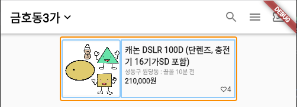
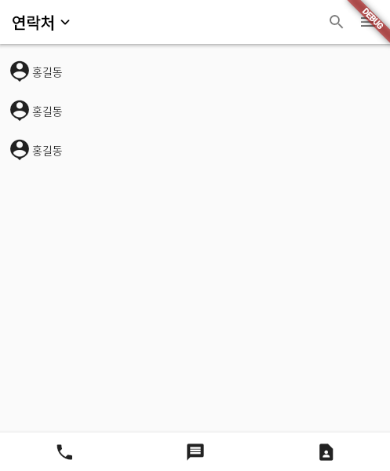

# flutter_practice

## Day1_Box design

- 레이아웃
  - Scaffold() 위젯 - appBar, body, bottomNavigatoinBar
  - Row, Column 위젯 - `MainAxisAlignment`, `CrossAxisAlignment`
  - Container vs. SizedBox
  - 박스꾸미기 - margin, padding, decoration
  - 박스위치정렬 - Align

## Day2_Custom Widget

- Flexible, Expanded

- Devtools

- Custom Widget

  