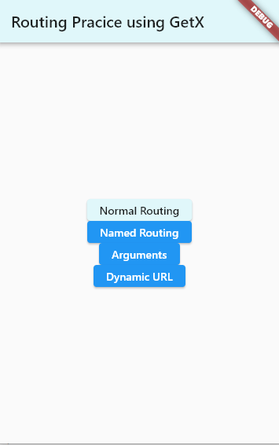
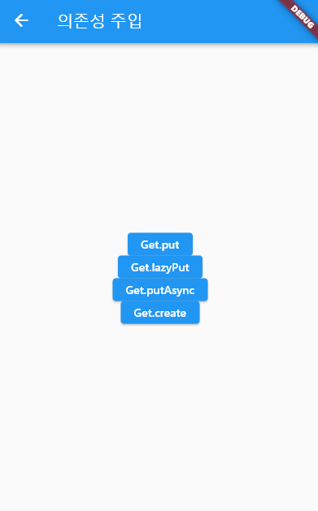

# flutter_practice

## Day1_Box design

- 레이아웃
  - Scaffold() 위젯 - appBar, body, bottomNavigatoinBar
  - Row, Column 위젯 - `MainAxisAlignment`, `CrossAxisAlignment`
  - Container vs. SizedBox
  - 박스꾸미기 - margin, padding, decoration
  - 박스위치정렬 - Align

## Day2_Custom Widget

- Flexible, Expanded

- Devtools

- Custom Widget

  

## Day3_GetX

- Routing Navigator vs. GetX

  - 페이지 이동 `Get.to(Home())`, `Get.toNamed('/path')`
  - 뒤로가기 `Get.back()`
  - 히스토리 지우면서 이동 `Get.offAll(Home())`, `Get.offNamed('/path')`, `Get.offAllNamed('/path')`
  - arguments전달 `Get.to(Home(), arguments: '전달하려는 arguments')`
  - argunents전달받기 `Get.arguments`
  - 동적 parameter전달 `Get.toNamed('/user/46541?name=name&age=65')`

  

## Day4_GetX

- simple state manage(단순상태관리) 

- reactive state manage(반응형 상태관리)

- dependency injection(의존성 주입)

  

  